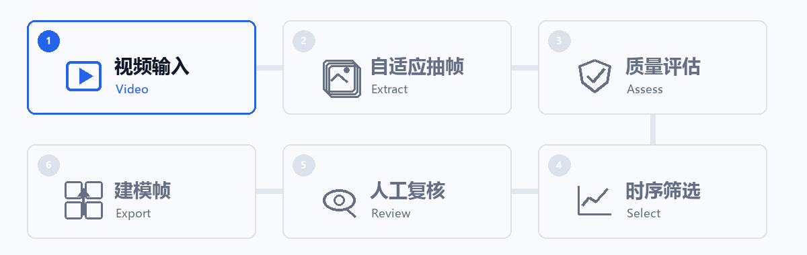
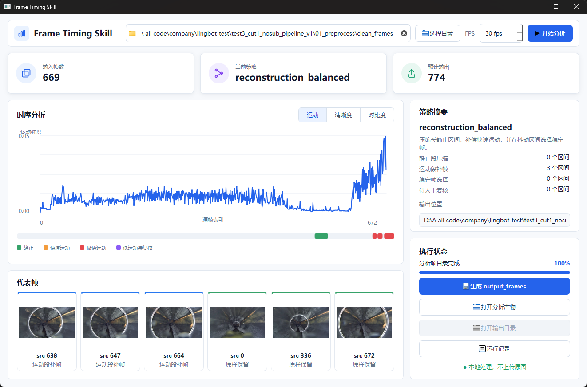
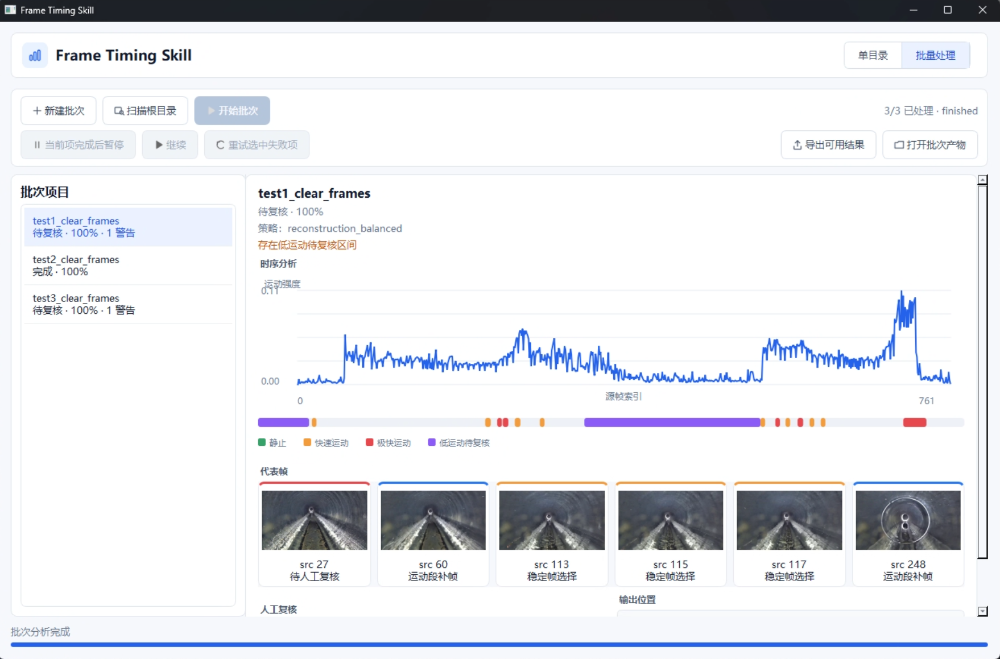

# Frame Timing Skill

[中文](README.md)

<p align="center">
  
</p>

[](https://github.com/Taiquan-Zhou/frame-timing-skill/releases/latest) [](https://github.com/Taiquan-Zhou/frame-timing-skill/actions/workflows/ci.yml) [](https://github.com/Taiquan-Zhou/frame-timing-skill/releases/latest/download/FrameTimingSkill-Windows-x64.zip)

The same deterministic core powers an **agent-ready interface** and a local Windows **human-in-the-loop workspace**: processing stays local, CPU-only batches are recoverable, and outputs are verified before downstream use.

Processing stays local and never modifies source media. Review, approval, and export remain explicit user actions.

## Desktop Workspace

### Choose a Workflow

- **Single-directory workspace:** analyze, review, and export one data source. Entry: `FrameTimingSkill.exe` / `frame-timing-ui`
- **CPU-only offline batch:** process multiple data sources sequentially and resume after interruption. Entry: Desktop Batch Processing / `frame-timing-tool batch`
- **Agent-safe v3:** integrate the Skill with an agent or another system. Entry: `frame-timing-tool`

### Single-directory Workspace

Inspect motion, sharpness, and contrast timelines together with ranges and representative frames, then generate `output_frames/`.

<p align="center">
  
</p>

### Recoverable Offline Batch

Analyze multiple items, isolate failures, and persist progress. Resume explicitly after interruption and approve `review_required` items before export.

<p align="center">
  
</p>

## Quick Start

### Windows Desktop App

**[Download FrameTimingSkill for Windows x64](https://github.com/Taiquan-Zhou/frame-timing-skill/releases/latest/download/FrameTimingSkill-Windows-x64.zip)**

1. Download and extract `FrameTimingSkill-Windows-x64.zip`.
2. Run `FrameTimingSkill.exe`.
3. Select an input, confirm the settings, and start processing.

Run artifacts are written under an isolated `output/` directory without overwriting source media.

### Python and Agent Skill

```bash
python -m pip install "frame-timing-skill @ git+https://github.com/Taiquan-Zhou/frame-timing-skill.git"

# Optional desktop UI
python -m pip install "frame-timing-skill[ui] @ git+https://github.com/Taiquan-Zhou/frame-timing-skill.git"
frame-timing-ui
```

```text
Install this skill: https://github.com/Taiquan-Zhou/frame-timing-skill

Use frame-timing-skill to prepare <video-or-frame-directory> for reconstruction.
Pause when review is required, and verify outputs before downstream use.
```

## Core Capabilities

- Raw-video ingestion, adaptive frame extraction, and quality assessment.
- Motion, sharpness, contrast, and temporal-range analysis.
- Reconstruction-coverage-aware frame selection and representative frames.
- Single-run workspace and recoverable CPU-only offline batches.
- Failure isolation, explicit retry, human approval, and explicit export.
- Input and strategy binding, byte-level output verification, and audit artifacts.

## Agent and System Integration

### Agent-safe v3 JSON CLI

`frame-timing-tool` provides a stable JSON interface for agents and system integration. The compatibility one-command workflow remains available:

```bash
frame-timing path/to/clean_frames
```

<details>
<summary><strong>View the five-stage CLI</strong></summary>

The programmatic workflow preserves explicit safety boundaries:

```text
analyze -> plan -> validate -> apply -> verify
```

```bash
frame-timing-tool analyze --frames path/to/clean_frames --artifact-root output/frame_timing_run
frame-timing-tool plan --analysis output/frame_timing_run/analysis.json --policy coverage_first
frame-timing-tool validate --analysis output/frame_timing_run/analysis.json --strategy output/frame_timing_run/strategy.json
frame-timing-tool apply --frames path/to/clean_frames --analysis output/frame_timing_run/analysis.json --strategy output/frame_timing_run/strategy.json --validation output/frame_timing_run/validation.json --output-dir output/frame_timing_run/output_frames
frame-timing-tool verify --frames path/to/clean_frames --artifact-root output/frame_timing_run
```

Policies are `coverage_first`, `balanced`, and `jitter_reduction`; `coverage_first` is the recommended default.

</details>

<details>
<summary><strong>Offline Batch CLI</strong></summary>

Batch state is stored at `output/**/analysis/batch_state.json`:

```bash
frame-timing-tool batch create --frames path/to/a/frames --frames path/to/b/frames --state output/frame_timing_batch/analysis/batch_state.json --fps 30
frame-timing-tool batch run --state output/frame_timing_batch/analysis/batch_state.json
frame-timing-tool batch status --state output/frame_timing_batch/analysis/batch_state.json
frame-timing-tool batch run --state output/frame_timing_batch/analysis/batch_state.json --retry-item FAILED_ITEM_NAME
frame-timing-tool batch approve --state output/frame_timing_batch/analysis/batch_state.json --item ITEM_NAME --note "reviewed"
frame-timing-tool batch export --state output/frame_timing_batch/analysis/batch_state.json
```

</details>

## Trust Boundaries

- Source media remains unchanged and outputs are written to isolated directories.
- Analysis and strategy results are reproducible for fixed inputs and configuration.
- Neither the app nor an Agent automatically resumes, retries, approves, or exports.
- Agent-safe v3 uses `schema_version 3` and policy revision `coverage-static-thinning-v1`.
- Analysis, strategy, validation, execution, health, and human-review artifacts are stored under `output/frame_timing_run/`.
- Output frames are byte-identical source-frame copies; only verified `output_frames/` should be passed downstream.

This project prepares data for reconstruction; it does not perform 3D reconstruction or model training.

## License

MIT. See [LICENSE](LICENSE).
