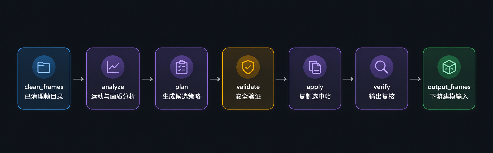

# Frame Timing Skill

[English](README.en.md)

Frame Timing Skill 是一个面向三维重建、NeRF、Gaussian Splatting、摄影测量和人工审查流程的帧时序选择工具。它用于处理已经清理好的图片帧目录，在进入建模或人工复核之前，先把明显冗余、静止、低价值或高风险的帧选择问题转化为可验证的本地决策。

它会分析帧间运动、静止区间、抖动趋势、画面质量和策略风险，生成不同风险等级的候选方案，并在执行前进行独立验证。最终输出的帧会按字节级一致的方式从源目录复制，完整保留原始图像数据。

Agent-safe v3 工作流把分析、规划、验证、应用和复核拆成明确阶段，方便 AI Agent、自动化管道和人工审查共同使用。它强调可复现、可追踪、可回滚的帧选择，而不是黑箱式删除帧。

它不负责视频抽帧、像素修改、上传数据或执行重建。Agent-safe v3 提供的是帧选择层面的覆盖保护。

<p align="center">
   analyze -> plan -> validate -> apply -> verify -> output_frames" width="100%">
</p>

## 普通用户

让你的 AI Agent 或 AI 编程工具安装这个仓库作为 skill：

```text
Install this skill: https://github.com/Taiquan-Zhou/frame-timing-skill
```

然后让它处理已经清理好的帧目录。推荐让 Agent 使用 v3 分阶段工作流：

```text
Use frame-timing-skill on path/to/clean_frames.
Analyze first, compare candidates if needed, validate before apply, and verify before using output_frames downstream.
```

如果只需要本地一条命令的兼容流程，可以使用：

```bash
frame-timing path/to/clean_frames
```


## AI Agent 和开发者

从仓库安装 Python 包：

```bash
python -m pip install git+https://github.com/Taiquan-Zhou/frame-timing-skill.git
```

### Agent-safe v3 JSON CLI

当 Agent 需要明确、可审计的阶段时，使用 `frame-timing-tool`。该生命周期使用 `schema_version 3` 和策略修订号 `coverage-static-thinning-v1`。

```bash
frame-timing-tool capabilities
frame-timing-tool analyze --frames path/to/clean_frames --artifact-root output/frame_timing_run
frame-timing-tool plan --analysis output/frame_timing_run/analysis.json --policy coverage_first
frame-timing-tool validate --analysis output/frame_timing_run/analysis.json --strategy output/frame_timing_run/strategy.json
frame-timing-tool apply --frames path/to/clean_frames --analysis output/frame_timing_run/analysis.json --strategy output/frame_timing_run/strategy.json --validation output/frame_timing_run/validation.json --output-dir output/frame_timing_run/output_frames
frame-timing-tool verify --frames path/to/clean_frames --artifact-root output/frame_timing_run
```

v3 策略：

- `coverage_first`：推荐给重建场景使用的默认策略；保护非静止帧覆盖，只对确认的静止段做保守抽稀。
- `balanced`：中等风险的对比候选。
- `jitter_reduction`：更激进的对比候选；适合视觉审查，但对重建覆盖风险更高。

中高风险候选展示给用户确认。验证失败时不靠手工编辑 JSON 绕过；apply 阶段会重新验证候选摘要和策略身份。

## License

MIT. See [LICENSE](LICENSE).
